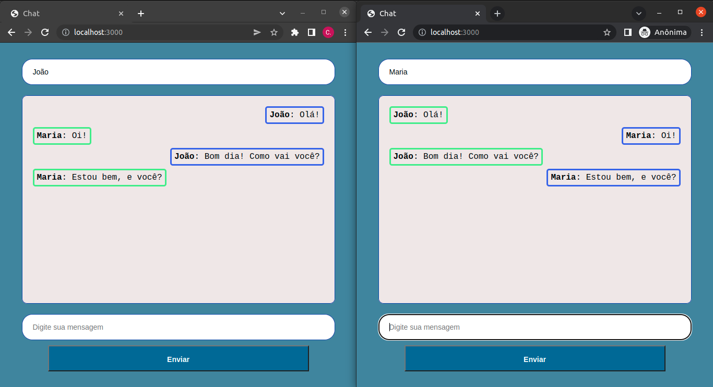

# Chat-SocketIO-NodeJS
Um Chat em tempo real implementado em NodeJS utilizando as bibliotecas socket.io e jQuery.  

## Implementação
  - Só é possível enviar a mensagem se o campo nome estiver preenchido;  
  - Ao enviar uma mensagem ela é apresentada ao lado direito dentro do campo no meio da página;  
  - Aos sockets que receberam a mensagem a mesagem aparece ao lado esquerdo;  
  - As mensagens enviadas são salvas em um array de objetos e qualquer socket que fizer uma nova conexão receberá todas as mensagens anteriores;  
  - Toda mensagem enviada é direcionada para todos os sockets conectados.  

## Apresentação  
  - 2 sockets conversando entre si;  
  - 1º input: Nome do usuário;  
  - 2º input: Mensagem a ser enviada;  
  - Campo central para exibição das mensagens.  
  
